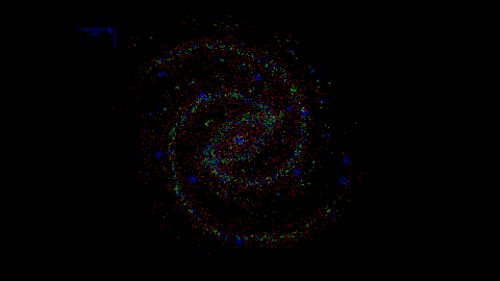
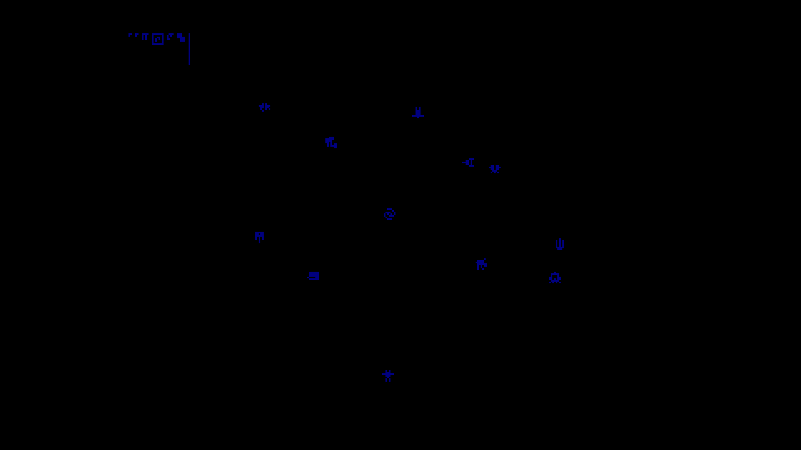
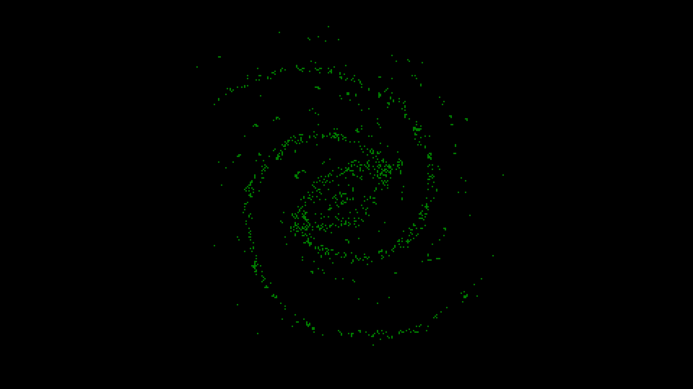
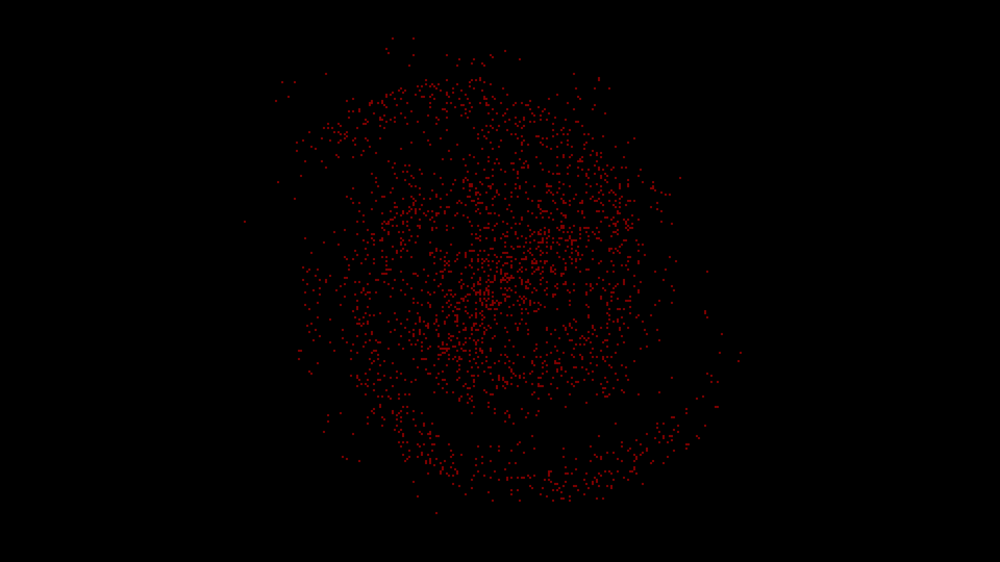
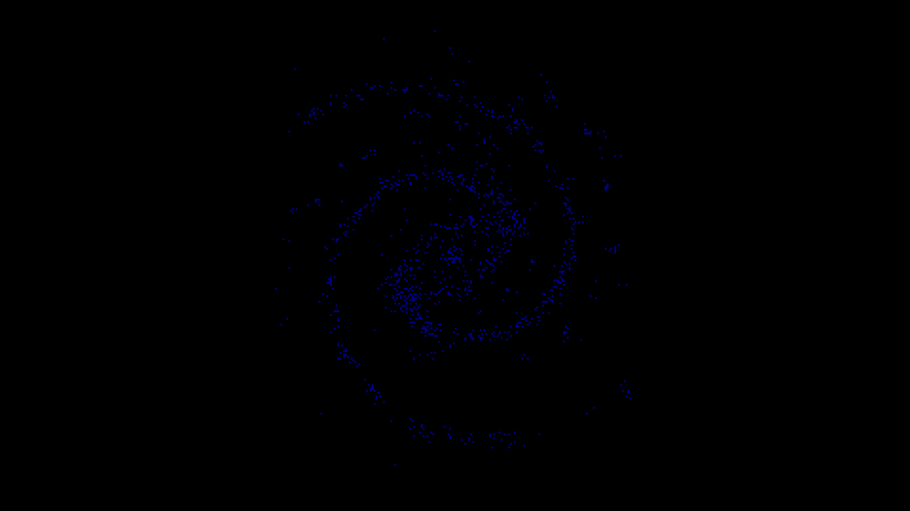
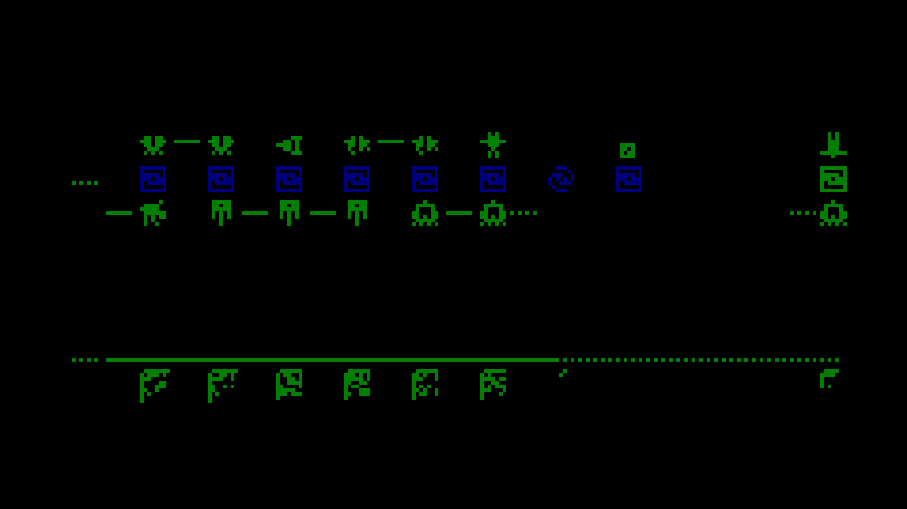

# icfp-2020

This repository contains the following:

- An interpreter for the [alien calculus][ac] in [`src/eval.rs`](src/eval.rs), heavily based on the [pseudocode][ps]
- An interactive GUI for the galaxy [interaction protocol][ip] in [`galaxy/main.rs`](galaxy/main.rs)
- An autonomous ship controller for the [local tournament][lt] in [`submit/main.rs`](submit/main.rs)

# Screenshots

**Galaxy Entrypoint**

**Individual Layers**

**Tournament Timeline**

# GUI Controls

- Click to interact
- W, A, S, D or up, down, left, right to pan
- Q or E to decrease or increase panning speed
- `-` or `=` to decrease or increase zoom

[ac]: https://message-from-space.readthedocs.io/en/latest/condensed-version.html
[ip]: https://message-from-space.readthedocs.io/en/latest/message38.html
[lt]: https://message-from-space.readthedocs.io/en/latest/game.html
[ps]: https://message-from-space.readthedocs.io/en/latest/implementation.html
